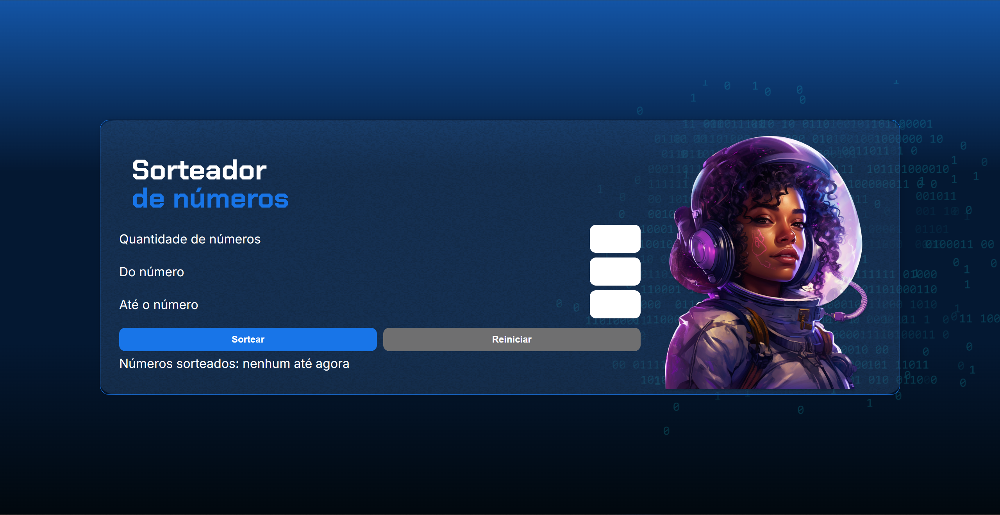

<!--Copyright (c) 2024 Fernanda Kipper Bucoski de Sousa-->

[JAVASCRIPT__BADGE]: https://img.shields.io/badge/Javascript-000?style=for-the-badge&logo=javascript

<h1 align="center" style="font-weight: bold;">Sorteador de Números 💻</h1>

![javascript][JAVASCRIPT__BADGE]

<p align="center">
    
</p>

<h2 id="started">📌 Sobre</h2>

O Sorteador de Números foi um projeto realizado durante um curso da Alura. O qual, consiste em sortear uma quantidade de números definida pelo usuário do número x ao y. Neste projeto, trabalhei somente com o Javascript pois a estilização e marcação da página recebi prontas pelos instrutores da Alura. 

<h2>Clonando o projeto</h2>

Como clonar o projeto:

```bash
git clone https://github.com/AlissonSimon/Sorteador-numeros.git
```
